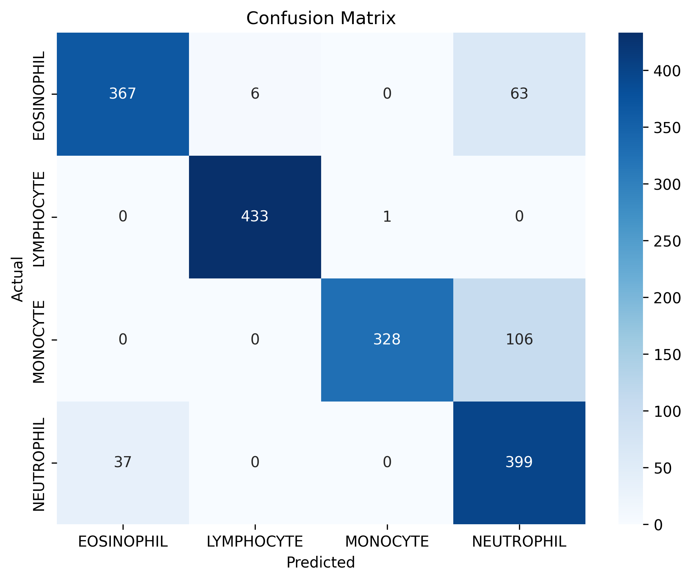
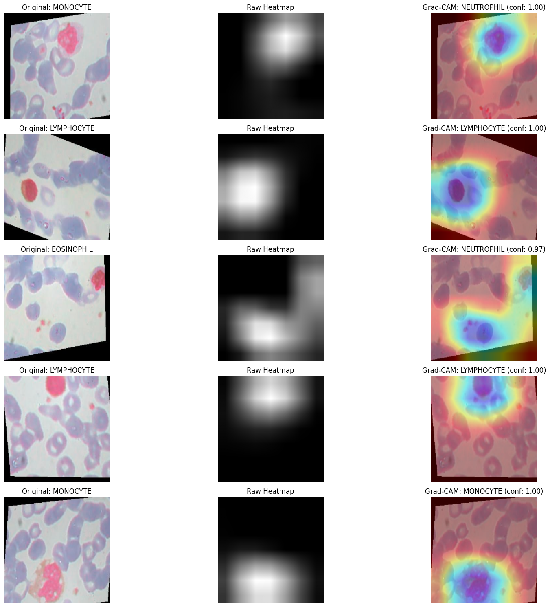

# Blood Cell Type Classification using ResNet18

This repository contains a Jupyter notebook (`cell_type_classificaiton_resnet.ipynb`) implementing a deep learning model for classifying blood cell images into four types using a pre-trained ResNet18 architecture. The model is built with PyTorch and includes data preprocessing, training, evaluation, and visualization using Grad-CAM.

## Table of Contents

- [Dataset](#dataset)
- [Task](#task)
- [Approach](#approach)
- [Results](#results)
- [Requirements](#requirements)
- [How to Run](#how-to-run)
- [License](#license)

## Dataset

The dataset used is the "Blood Cell Images" dataset from Kaggle, which consists of microscopic images of blood cells divided into training and testing sets. It includes four classes:

| Class Name   | Description                                                                 |
|--------------|-----------------------------------------------------------------------------|
| EOSINOPHIL   | White blood cells involved in fighting parasites and allergic reactions.     |
| LYMPHOCYTE   | White blood cells crucial for immune responses, including B-cells and T-cells. |
| MONOCYTE     | Large white blood cells that differentiate into macrophages and dendritic cells. |
| NEUTROPHIL   | The most common white blood cells, primarily responsible for fighting bacterial infections. |

- **Size**: Approximately 9,957 training images and 2,487 testing images.
- **Format**: Images are organized in folders: `/dataset2-master/dataset2-master/images/TRAIN/` and `/dataset2-master/dataset2-master/images/TEST/`.
- **Preprocessing**: Images are resized to 224x224 pixels and normalized (divided by 255).

**Dataset Link**: [Blood Cells Dataset](https://www.kaggle.com/paultimothymooney/blood-cells)

To use, download the dataset and place it in the project root or update the `image_folder` path in the notebook.

## Task

The task is multi-class image classification to predict the type of blood cell (Eosinophil, Lymphocyte, Monocyte, or Neutrophil) from a given microscopic image. This has applications in medical diagnostics, such as automated blood smear analysis for detecting abnormalities or infections.

## Approach

The approach leverages a pre-trained ResNet18 model with PyTorch for blood cell classification. Key steps include:

1. **Data Loading and Preprocessing**:
   - Images are loaded using OpenCV, resized to 224x224, and normalized.
   - The test set is split into validation (30%) and test sets using stratified sampling to maintain class distribution.
   - Data augmentation (random horizontal flips, rotations, color jitter) is applied to the training set using PyTorch transforms.
   - Datasets are converted to PyTorch tensors and loaded via DataLoaders (batch size 32).

2. **Model**:
   - A pre-trained ResNet18 (from torchvision) is used, with the final fully connected layer modified to output 4 classes.
   - Training is performed on GPU (if available) using the Adam optimizer (learning rate 0.001, weight decay 1e-4) and a StepLR scheduler (step size 7, gamma 0.1).
   - Loss function: Cross-Entropy Loss (no label smoothing).

3. **Training**:
   - Trained for 15 epochs with early stopping and checkpointing (best model saved based on validation accuracy).
   - Batch labels are processed to ensure integer format, handling one-hot encoded labels if necessary.

4. **Evaluation**:
   - Metrics: Test loss, accuracy, classification report, and confusion matrix (using scikit-learn).
   - Visualization: Grad-CAM heatmaps to highlight regions influencing model predictions.

5. **Visualization**:
   - Grad-CAM is implemented to generate heatmaps for sample test images, showing areas of focus for predictions.

## Results

The model achieves the following performance on the test set:

- **Test Accuracy**: 87.76%
- **Test Loss**: 0.8607

### Classification Report
| Class       | Precision | Recall | F1-Score | Support |
|-------------|-----------|--------|----------|---------|
| EOSINOPHIL  | 0.91      | 0.84   | 0.87     | 436     |
| LYMPHOCYTE  | 0.99      | 1.00   | 0.99     | 434     |
| MONOCYTE    | 1.00      | 0.76   | 0.86     | 434     |
| NEUTROPHIL  | 0.70      | 0.92   | 0.79     | 436     |
| **Accuracy**|           |        | 0.88     | 1740    |
| **Macro Avg**| 0.90     | 0.88   | 0.88     | 1740    |
| **Weighted Avg** | 0.90  | 0.88   | 0.88     | 1740    |

### Confusion Matrix



### Grad-CAM Visualization
Below is a sample Grad-CAM visualization showing the original image, raw heatmap, and overlaid heatmap for a test image. The heatmaps highlight regions the model focuses on for predictions, aiding interpretability.



- **Insights**: The model performs best on Lymphocyte (99% F1-score) but struggles with Monocyte and Neutrophil due to visual similarities, as seen in the confusion matrix (e.g., 106 Monocytes misclassified as Neutrophils).
- **Grad-CAM**: The visualization confirms the model focuses on relevant cell features, enhancing trust in its predictions.


## Requirements

- **Python**: 3.8 or higher
- **Libraries**:
  - `torch`
  - `torchvision`
  - `opencv-python`
  - `tqdm`
  - `scikit-learn`
  - `matplotlib`
  - `numpy`
  - `tensorflow` (for `to_categorical`, though primarily PyTorch-based)
- Install dependencies: `pip install -r requirements.txt`

Create a `requirements.txt` file with the above libraries if needed.

## How to Run

1. Download and extract the [Blood Cells Dataset](https://www.kaggle.com/paultimothymooney/blood-cells).
2. Place the dataset in the project root or update the `image_folder` path in the notebook.
3. Install dependencies: `pip install -r requirements.txt`.
4. Run the Jupyter notebook:
   ```bash
   jupyter notebook cell_type_classificaiton_resnet.ipynb
